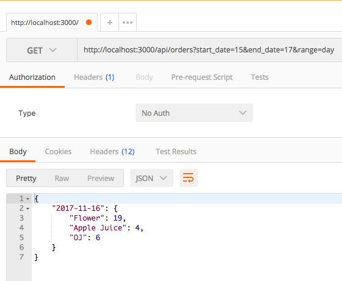
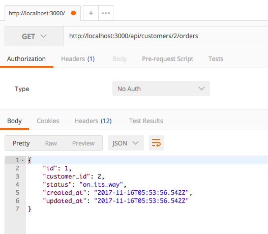

== README

Download, unzip, `cd` into the folder and `bundle install`.
Run the webapp `rails s`


**Question 1 - 2**
Model is straight forward:
Customer - has_many -> Orders - has_many -> Lineitems - belongs_to -> Product <- many to many -> Categories
With the use of Rails ActiveRecord magic, the association is easily extensible. The concern is with efficiency and avoiding n+1 queries.

**3-4. SQL query**
```
query = <<-SQL
  SELECT c.id AS customer_id,
  c.name AS customer_first_name,
  cat.id AS category_id,
  cat.name AS category_name,
  COUNT(li.id) AS number_purchased
  FROM customers AS c
  JOIN orders AS o on c.id = o.customer_id
  JOIN lineitems AS li on o.id = li.order_id
  JOIN products AS p on li.product_id = p.id
  JOIN product_categories AS prodcat on prodcat.product_id = p.id
  JOIN categories AS cat on cat.id = prodcat.category_id
  WHERE cat.name = 'Bouquets' AND c.name = 'John';
SQL
```

A lot of JOIN, which isn't ideal but is necessary for gathering cumulative data on orders.
I probably could have combined lineitem table with the order table to reduce complexity but in the long run, it's better design to have these separate.

Same can be done with Rails ActiveRecord ORM:

```
  Customer.find_by_name(customer).orders.all.each{|order| count += order.lineitems.select{|li| li.product.categories.include?(cat)}.count}
```

Both are implemented as a class function on the Customer model.

**5. Filter params**

Three of the below url params are required to return this reporting response.
Would be better to have a dedicated endpoint for this as the response is specialized compared to that of regular indexing of orders.

```
http://localhost:3000/api/orders?start_date=15&end_date=17&range=day

{
    "2017-11-16": {
        "Flower": 19,
        "Apple Juice": 4,
        "OJ": 6
    }
}
```



The logic was to query for start to start + range.
And continue until the start is larger than endDate.
Nested ternary not the most readable code but felt it was better than adding more if statements. Clarification with comment should be sufficient in this case.

```
while(date <= endDate) do
  endRangeDate = range == 'day' ? date + 1.day : range == 'week' ? date + 1.week : date + 1.month
  order = Order.where(created_at: date..endRangeDate.midnight).includes(lineitems: :product)
```

**6. Customer order**

```
http://localhost:3000/api/customers/2/orders
```



**Additional**

- Giving one-click bulk-items.
This would require a separate Table for each User to maintain a list.
It would be a BulkOrder Table, in which it would have a many to many relation with Product.
Maintaining a pointer to the Product and not directly storing it in the BulkOrder Table means the product can be updated without costly modifications across the board.
The problem could lie with differences of regular product vs bulk one-click product. If special fields are required, this can add more complexity to the table.
Also, maintaining a many to many association would require JOINing which can be costly.

- If an inventory is low on stock and the inventory is moving quickly, there is a chance of a race-condition where an inventory is sold on multiple carts.
One way to handle this is to decrement the inventory stock as soon as the item is added onto the cart and give the user a set amount of time to complete checkout.
This can be implemented using the created_at field of the lineitems Table and have a expiration time before the order status is changed to completed.

Future Improvements
- Implement tax and discount calculation.
- Implement stock tracking and analytics
- Flush out more reporting endpoints
